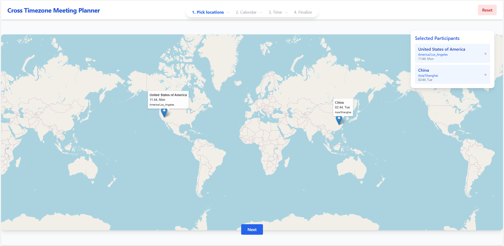
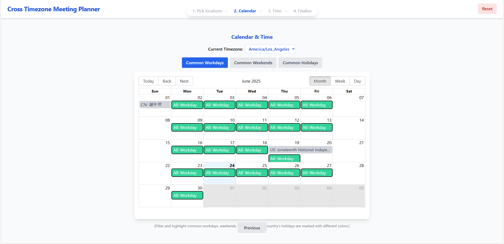
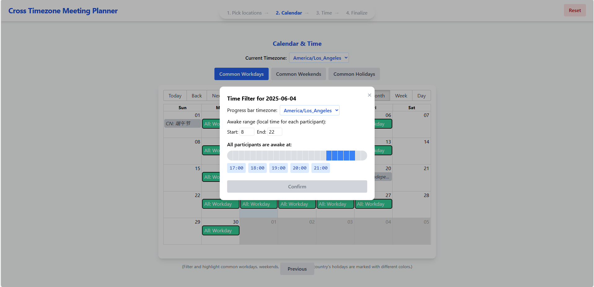

# Cross Timezone Meeting Planner

A modern, privacy-friendly web app for planning meetings across timezones. Select locations on a map, view local times and public holidays, and find the best meeting time for everyone—all in a beautiful, local-first React app.

## Features

- 🌍 **Map-based Location Picker**: Click on the map to add participants by country/region. No external geolocation APIs or tokens required.
- 🕒 **Timezone & Local Time Display**: Instantly see each participant's timezone and current local time.
- 📅 **Smart Calendar**: View and filter by common workdays, weekends, or public holidays. Holidays are fetched from the [nager.at](https://date.nager.at/) API and visually highlighted.
- 🎉 **Public Holiday Integration**: Automatically fetches and caches public holidays for all selected countries and the visible calendar range.
- ⏰ **Time Filter & Visualization**: Interactive progress bar shows all hours when all participants are awake (customizable). Select a time and see the result in each participant's local time.
- 💡 **Local-First & Privacy-Respecting**: All location, timezone, and country lookups are fully local. No API keys, no tracking, no personal data leaves your device (except for public holiday queries).
- 🎨 **Beautiful, Responsive UI**: Styled with TailwindCSS, featuring gradients, cards, and a modern, accessible design.

## Tech Stack

- [React](https://react.dev/) + [Vite](https://vitejs.dev/)
- [TailwindCSS](https://tailwindcss.com/)
- [Leaflet.js](https://leafletjs.com/) (map)
- [Luxon](https://moment.github.io/luxon/) (date/time)
- [react-big-calendar](https://github.com/jquense/react-big-calendar) (calendar)
- [tz-lookup](https://github.com/darkskyapp/tz-lookup) (timezone lookup)
- [@turf/turf](https://turfjs.org/) (geo queries)
- [axios](https://axios-http.com/) (API requests)

## Getting Started

1. **Clone the repository:**
   ```bash
   git clone https://github.com/thomas-art/cross-timezone-meeting-planner.git
   cd cross-timezone-meeting-planner
   ```
2. **Install dependencies:**
   ```bash
   npm install
   ```
3. **Start the development server:**
   ```bash
   npm run dev
   ```
4. Open [http://localhost:5173](http://localhost:5173) in your browser.

## Usage Guide

1. **Pick Locations:**
   - Click on the map to add participants. Each location shows country, timezone, and current local time.
   - Add as many locations as needed. Remove any by clicking the "×" next to their name.
   
   
   *Pick locations on the map*
2. **View Calendar:**
   - Switch to the calendar step. Filter by common workdays, weekends, or holidays. Holidays are color-coded by country.
   
   
   *View and filter the calendar*
3. **Select Date & Time:**
   - Click a date to open the time filter. Adjust awake hours if needed. Select a suitable hour when all are awake.
   
   
   *Select a suitable time for all participants*
4. **See Results:**
   - Confirm your selection to view the meeting time in each participant's local time, beautifully displayed.
5. **Reset:**
   - Use the Reset button to start over at any time.

## Privacy & Data

- All location, timezone, and country lookups are performed locally using open data and libraries.
- The only external request is to the [nager.at](https://date.nager.at/) API for public holiday data (country code and year only).
- No personal data, tokens, or meeting details are sent to any server.

## Contributing

Contributions are welcome! Please open issues or pull requests for improvements, bug fixes, or new features.

## License

This project is open source. If you wish to specify a license, please add a LICENSE file (e.g., MIT, Apache 2.0, GPL, etc.). 